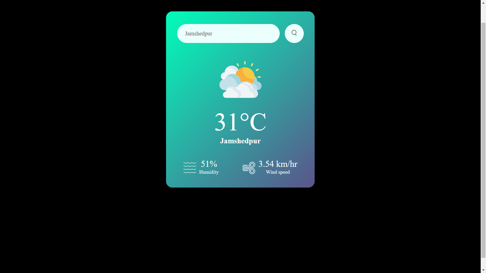
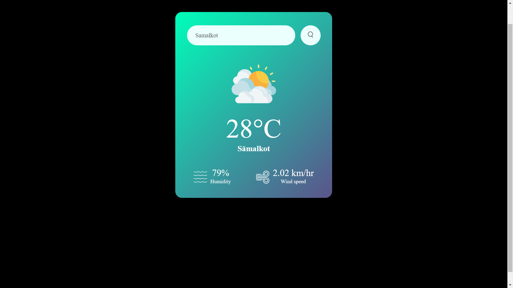

# Weather Card Application

The Weather Card Application is a simple web-based tool that allows users to search for current weather information by city. It displays the temperature, humidity, wind speed, and an appropriate weather icon based on the weather conditions.

## Features

- Search for weather information by city name.
- Display current temperature, humidity, and wind speed.
- Show a weather icon based on the current weather conditions.
- Handle errors such as invalid city names.

## Technologies Used

- HTML
- CSS
- JavaScript
- OpenWeatherMap API

### Main Interface


### Search for a City


### Weather Information


### Error Message


## Installation

1. Clone the repository:
    ```sh
    git clone https://github.com/yourusername/weather-card-app.git
    ```

## Usage

1. Enter a city name into the search box.
2. Click the search button.
3. View the weather information displayed on the card.
